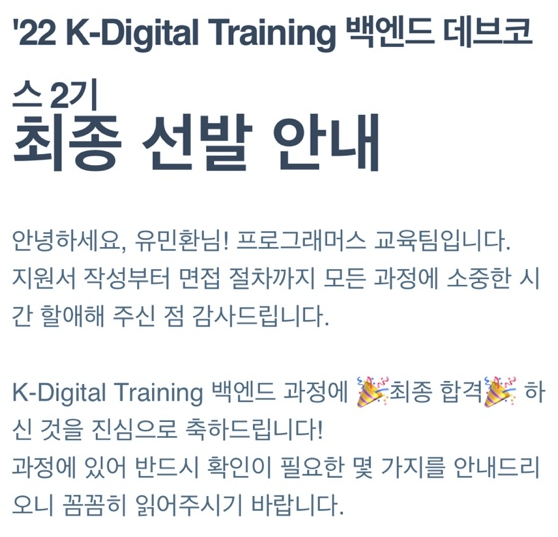

# 2022 회고

## 끝 그리고 새로운 시작 

2022년 2월 졸업을 한 뒤 22년이 가기 전에 취뽀를 하게 되었다.

이렇게 빨리 취업을 하게 될지는 몰랐지만 그간의 노력이 빛을 볼 수 있어 다행이라고 생각한다. 

2022년이 가기 전에 회고와 마음가짐을 정리해보고자 한다.

## 1. 우아한 테크코스 탈락 

때는 2021년 즉, 대학교 4학년때 나는 6개월간의 학부 프로젝트 2개를 경험하였고 경진대회에서 상도 받았지만 할 줄 아는 것이 없었다. 
CS지식도 부족하였고 프로젝트에서 사용한 기술스택에 대한 이해도도 많이 낮았다. 

그렇다보니 취업을 하기에는 아직 준비가 안되었다고 이력서도 쓰지 않았다. 

지금 생각해보면 어리석은 선택이였던 것 같다. 지원과정 뿐만 아니라 운이 좋아 면접까지 가보았다면 분명 얻는 것이 있을 텐데 빠르게 도전해보지 않은 점이 많이 아쉽다...

일단 실력적으로 많이 낮다고 판단하다보니 실력을 키웠어야 했는 데 혼자 하기에는 어떤 것을 공부해야 하는 지도 잘 몰랐고 하더라도 잘못된 길을 가면 어쩌나 라는 생각을 가지게 되었다. 그러다보니 자연스럽게 교육에 눈이 가게 되었고 그 중 가고 싶던 기업인 우아한형제들의 우아한 테크코스 과정을 지원하게 되었다. 

당시에 우아한 테크코스의 지원서를 2주 가량 잡고 친구에게 피드백을 받으며 열심히 썼던 기억이 난다. 되돌아서 생각해보면 한심한 지원서였고 결과는 당연히 지원에서부터 탈락하게 되었다. (코테도 치긴 했지만 내가 생각했을 땐 서류부터 탈락했을 것 같다.)

당시에 탈락이라는 경험이 처음이다보니 좌절감이 장난 아니였다. 그러던 찰라 우아한 테크코스 오픈채팅방에서 탈락자들끼리 스터디를 해보지 않겠냐는 말이 나오게 되었고 해당 스터디를 참여하게 되었다. 이름하여 `우테코 복수방`이였다. 

[당시 진행한 깃허브 레포](https://github.com/REVENGE-WOOTECO)

당시 스터디가 특이했던 것이 탈락자들만 모여 진행하는 것이 아니라 우테코 프리코스를 동일하게 구현하고 우테코 3기분들에게 코드리뷰를 받는 식으로 진행이 되었다.

부끄럽지만 당시에 테스트나 객체지향 등 많이 부족했기 때문에 그만큼 많이 공부하고 구현하였고 코드 리뷰를 받으면서 많이 성장할 수 있었다. (새로운 문물을 접한 느낌..!!) 아마 이 과정이 없었다면 지금도 아무것도 모르는 상태지 않을까? 라는 생각이 든다.

해당 스터디를 진행하면서 처음으로 코드 리뷰를 받아보고 블로그에 정리하며 글도 써보고 참 재미있었다. (지금도 글을 잘 쓰진 못하지만 당시에 썼던 것을 보면 가관이다 ㅋㅋㅋㅋ ) 이 자리를 빌어 우테코 3기분들에게 다시 한번 감사드린다.

그렇게 2021년이 마무리 되어갔다.

## 3. 프로그래머스 백엔드 데브코스 합격 

우테코 탈락과 스터디 이후 다른 교육과정을 찾게 되었다. 교육과정을 찾으며 코드 리뷰 과정있으며 함께 하는 과정인가?를 많이 확인했던 것 같다. 이도 그럴 것이 스터디를 하면서 코드 리뷰 뿐만 아니라 함께 성장한다는 것의 힘?을 맛보았기 때문이다.

그렇게 찾던 와중 프로그래머스 백엔드 데브코스 2기를 모집한다는 글을 보게 되었고 확인해보니 내가 찾던 과정이라는 것을 한번에 알 수 있었다. 

사실 해당 과정은 1기때 지원했다가 지원서에서 광탈한 경험이 있었다. 그러다보니 지원서에서 또 떨어지면 어떡하지라는 두려움에 의해 지원서에 모든 힘을 쏟아부었던 것 같다. 

간절함이 닿았는 지 서류 합격을 하게 되었고 코딩 테스트를 보게 되었다. 당시에 코딩 테스트를 통과하기 위해 1~2주 동안은 코테 문제만 풀며 대비를 하였던 것 같다. (지금도 느끼지만 코테는 아직도 어렵....)

다행히 문제는 내 수준에서도 풀 수 있는 정도의 난이도로 나오게 되었고 무난히? 통과할 수 있었다. 

마지막 관문으로 면접이 남았었는 데 당시 면접 경험이 없어 친구들에게 모의 면접을 부탁하거나 후기들을 보며 준비했던 기억이 난다. 

그렇게 면접 당일날이 되고 덜덜 떨면서 면접을 보았던 것 같다. 면접을 본 후 든 생각은 `떨어졌겠구나`였다. 기본적인 CS질문에도 대답을 명확하게 하지 못했기 때문에 그런 생각을 한 듯하다.

그러다 친구와 당구를 치던 와중 면접 결과를 받게 되었고 걱정과는 다르게 합격을 하게 되었다. 당구장에서 소리를 지르며 방방 뛰며 좋아했었다 ㅋㅋㅋㅋㅋ

그렇게 3월부터 8월까지 5개월간의 교육과정을 시작하게 되었다.

## 4. 프로그래머스 백엔드 데브코스 과정

## 5. 본격적인 취준 시작 

## 6. 합격 

## 7. 2023년 목표 